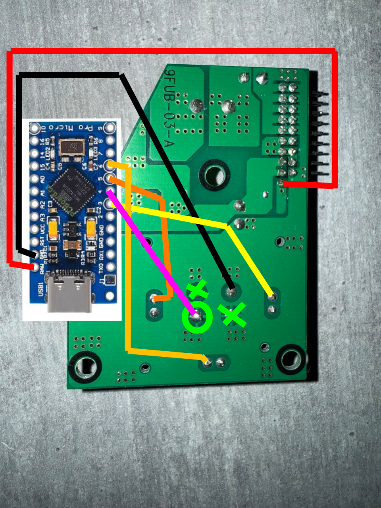
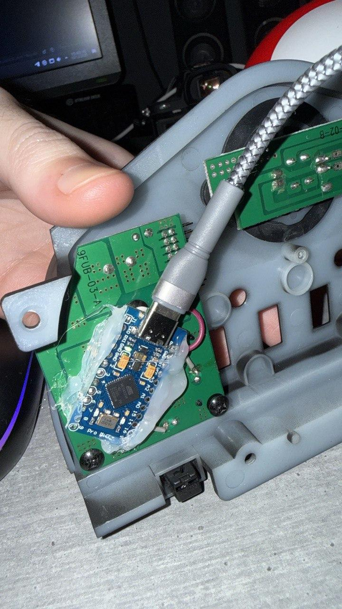

# Corsair Graphite 780T Fan Control mod
Long story short, I recovered this case, which I had sold to a friend about 10 years ago.

I missed it a lot, even though I have more modern cases like the Hyte Y60, but no case was the same as this one.

After restoring it, replacing all the LEDs (most of which were blown out) and swapping the fans for the Corsair RX series,
I wanted to be able to adjust fan speeds via software. But hey, I'm on Linux, so it didn’t come without difficulties.

First of all I found this repo: [jurkovic-nikola/OpenLinkHub](https://github.com/jurkovic-nikola/OpenLinkHub)
which contains software for Linux that allows controlling the RGB and speed/profiles of most Corsair fans.
It also exposes an HTTP API for that purpose.

The only missing part was that the fan controller of the case was "analog," not USB/software controlled,
so I had to adapt it. For that, I've modded the board that comes with the case (more info below)
so I could read the button presses from my software and control the LED indicator lights.

Then it was just a matter of writing a driver that connects the Arduino to OpenLinkHub, and that’s it.


## How does it work?
Basically, like the original, you press and you increment the speed, and cycle infinitely.

But I've added a bonus feature: if you hold the button for two seconds, it dims itself and turns off all the LEDs of the
cluster controlled by OpenLinkHub (RAM, AIO PUMP, Fans, etc.).

Just press again and LEDs will turn on again. It's useful when you wanna sleep!


## Board mod
I wanted the mod to be reversible. Even though you'll see that I’ll cut the traces of one of the button pins,
this trace is just a GND and does not affect anything since the opposite side of the button is not connected to anything.



So, the green circle is the aforementioned GND, whose traces must be cut.
The green X marks 2 button pins that need to be desoldered and bent so they do not make contact.

Solder the black wire to GND (don’t worry, that pin is isolated) and the trace you cut to pin 4 of the Arduino
(this might be tricky, as the pad won’t take solder anymore).

Solder the three LED legs to pins 3, 5, and 6 (these are PWM, which is important if you want cool effects).

Then solder RAW (5V from the USB) to the 5V input of the board (the only pin of the connector that’s alone, red cable).

Bear in mind you MUST NOT connect the original connector, as the analog fan control becomes unusable.

And yes, you can reverse this mod by just desoldering everything you soldered and resoldering the 2 pins of the button you bent.
The traces you cut were useless, so don’t worry.

Then just use hot glue to attach the 2 boards, placing them diagonally so the USB cable can exit via the case side:



By the way, it is recommented that you use an adapter from USB-A to internal USB header so you don't have to take a cable
outside the case. Remember you can merge two USB internal headers into one if they only use one row (which probably will
happen if you use a Corsair HUB or similar). 


## Arduino programming
Go to the [README](Arduino/README.md) in the Arduino directory.


## Build and install
Take a look in the constants section of the `main.cpp` file.
You've got to change your device identifier (the HUB one).
Also change VID/PID if you don't use the default I suggest.

It's important the executable runs as `root` for USB permissions.

After programming the Arduino, it's time to set up the driver, for that just use the included script as follows:

Just clone the project. When ready after changing the `main.cpp`, run the `install.sh` file.
```sh
git clone https://github.com/maduranma/corsair-780t-fan-control-mod.git
cd corsair-780t-fan-control-mod
chmod +x install.sh
./install.sh
```

## Can I see it?
I'm planning on making a YouTube video, but as of now, I can only offer short:

[](https://www.youtube.com/watch?v=hhb-0HZumsE)


That's it — enjoy your modded 780T case :)